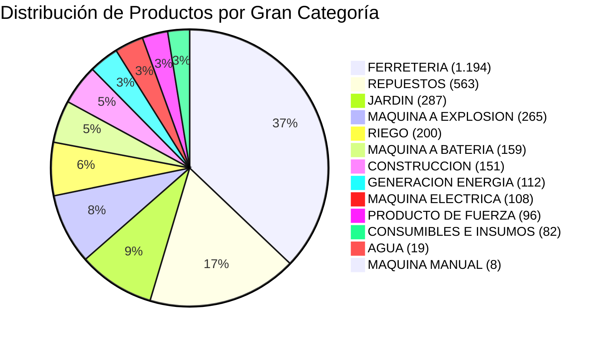

# 📊 Auditoría Completa del Catálogo Tiendanube — HMC HUB

> **Fecha:** 4 de Septiembre de 2026  
> **Archivo origen:** `data/tiendanube-productos.csv` (17.292 líneas / 3.398 productos únicos)  
> **Archivo optimizado UTF-8:** [`data/tiendanube-productos-utf8.csv`](file:///mnt/0076ECF676ECED7A/1_FABRICCKK/1_Trabajo/WEB/HMC_WEB/hmc_web/data/tiendanube-productos-utf8.csv)

---

## 1. Métricas Generales del Catálogo

| Métrica | Cantidad | Detalle / Estado |
|---|---|---|
| **Total de productos registrados** | **3.398** | Productos cargados en la plataforma |
| **Productos publicados (`Mostrar en tienda`)** | **3.398 (100%)** | Todos están visibles en la tienda online |
| **Productos con precio $0.00 / vacío** | **3.398 (100%)** | Todo el catálogo está cargado para cotización / consulta |
| **Marcas únicas detectadas** | **114 marcas** | Fabricantes con productos activos |
| **Productos sin NINGUNA categoría** | **1 producto** | Huérfano total (sin rubro ni marca) |
| **Productos con SOLO marca (sin rubro)** | **156 productos** | No aparecen al navegar por categorías |
| **Categorías únicas (combinaciones en uso)** | **582 rutas** | Jerarquías de árbol activas |

---

## 2. Árbol de Categorías Principales (Nivel 1)

El catálogo distribuye los productos entre **13 categorías de rubro** más la rama transversal `MARCAS`:

> [!NOTE]
> Adicionalmente, casi la totalidad de los productos (**3.397**) tienen asignada una categoría bajo la raíz `MARCAS > [Nombre de Marca]` en el campo de categorías de Tiendanube.

---

## 3. Hallazgos Críticos de Categorización

### ⚠️ Caso 1: Producto Huérfano Total (1 producto)
Hay 1 producto en el catálogo que no tiene **absolutamente ninguna categoría ni marca** asignada:
- **Nombre:** `ALIAFOR-DISCO LS-ABRASIVO 9"`
- **URL Handle:** `aliafor-disco-ls-abrasivo-9-10vfc`
- **SKU:** *(vacío)* | **Marca:** *(vacío)*
- **Categoría sugerida:** `FERRETERIA > ACCESORIO E INSUMOS > DISCOS CORTE Y ABRASIVOS` y `MARCAS > ALIAFOR`.

---

### ⚠️ Caso 2: 156 Productos con SOLO Categoría de Marca (Sin Rubro)
Existen **156 productos** que solo tienen asignada la marca (`MARCAS > ...`), pero **no tienen ninguna categoría funcional**.  
Si un usuario navega por el menú de categorías o aplica filtros por rubro, **estos productos nunca van a aparecer**:

- **Hunter (73 productos):** Toberas, aspersores rotativos, sensores de lluvia, electroválvulas.
- **Plástica Alfa (68 productos):** Codos, espigas, válvulas de cinta, adaptadores, herramientas de ajuste.
- **Senninger (8 productos):** Reguladores de presión y aspersores.
- **Rivulis (5 productos):** Filtros de malla (1", 1 1/2", 2").
- **Eurodrip (2 productos):** Goteros autocompensados.

> [!IMPORTANT]
> **Diagnóstico:** El 100% de estos 156 productos pertenecen al rubro **RIEGO**. Al momento de cargarlos se les asignó la marca pero se omitió agregarlos al árbol de Riego.

---

### ⚠️ Caso 3: Fragmentación y Duplicidad de Secciones Clave

1. **Riego dividido en dos categorías raíz:**
   - `[RIEGO]` $\rightarrow$ 200 productos (`ACCESORIO`, `CAÑOS Y MANGUERAS`, `CONSUMIBLE RIEGO`).
   - `[JARDIN > RIEGO]` $\rightarrow$ 100 productos (`CONECTORES`, `ASPERSORES`, `MANGUERAS`, `PROGRAMADORES`).
   - *Efecto:* El cliente que entra a "Jardín > Riego" se pierde 200 productos, y el que entra a "Riego" se pierde los 100 de jardín. Conviene unificar bajo un único árbol.

2. **Equipos a Batería y Eléctricos:**
   - Existe `[MAQUINA A BATERIA]` (159 productos: motosierras, cortacéspedes, sopladores) vs `[FERRETERIA > HERRAMIENTAS A BATERIA]` (133 productos: taladros, amoladoras, llaves de impacto).
   - Existe `[MAQUINA ELECTRICA]` (108 productos) vs `[FERRETERIA > HERRAMIENTAS ELECTRICAS]` (268 productos).
   - *Criterio actual:* En "Máquinas" se agruparon equipos de jardín/limpieza exterior y en "Ferretería" las herramientas de taller/obra. Es funcional, pero conviene que en el menú de navegación quede muy claro o se use la categoría "Herramientas a Batería" como paraguas.

3. **Limpieza fragmentada en 4 lugares distintos:**
   - `MAQUINA ELECTRICA > LIMPIEZA` (65 productos: hidrolavadoras y aspiradoras eléctricas).
   - `MAQUINA A BATERIA > LIMPIEZA` (12 productos: aspiradoras y barredoras a batería).
   - `MAQUINA MANUAL > LIMPIEZA` (8 productos: barredoras manuales y accesorios).
   - `MAQUINA A EXPLOSION > LIMPIEZA` (5 productos: hidrolavadoras a nafta).

---

### ⚠️ Caso 4: Errores Ortográficos y de Nomenclatura

| Categoría actual en Tiendanube | Tipo de problema | Corrección recomendada |
|---|---|---|
| `FERRETERIA > HERRAMIENTAS MANUALES > ACHA` | Falta ortográfica (sin H) | `... > HACHA` (o `HACHAS`) |
| `JARDIN > HERRAMIENTAS DE CORTE Y PODA > ACHA` | Falta ortográfica (sin H) | `... > HACHA` (o `HACHAS`) |
| `CONSTRUCCION > TERMINADO DE CONCRETO > ALLANADORAS - ALISADORAS` vs `ALLANADORAS-ALISADORAS` | Inconsistencia de espacios y guión (divide productos en 2 categorías distintas) | Unificar a `ALLANADORAS - ALISADORAS` |
| `FERRETERIA > HERRAMIENTAS MANUALES > LIMAS` vs `... > LIMA` | Singular vs Plural duplicado | Unificar a `LIMAS` |
| `MAQUINA ELECTRICA > FORESTAL Y PODA > MOTOSIERRA` vs `... > MOTOSIERRAS` | Singular vs Plural duplicado | Unificar a `MOTOSIERRAS` |
| `FERRETERIA > HERRAMIENTAS ELECTRICAS > TERMOSfusora Elect` | Formato mixto / truncado | `TERMOFUSORAS ELECTRICAS` |
| `CONSTRUCCION > ACCESORIOS E INSUMOS > Ahoyadora y mechas Husq.` | Abreviatura y minúsculas | `AHOYADORAS Y MECHAS` |
| `CONSTRUCCION > Superficie y pulido > ...` | Minúsculas vs resto en mayúsculas | `SUPERFICIE Y PULIDO` |
| `ACCESORIO E INSUMOS` vs `ACCESORIOS E INSUMOS` | Singular vs Plural entre ramas | Estandarizar a `ACCESORIOS E INSUMOS` |

---

### ⚠️ Caso 5: Discrepancias en Marcas (Columna "Marca" vs Categoría "MARCAS")

Existen 114 marcas en la columna de atributos y 113 en categorías, con 4 discordancias concretas:

1. **Typo `SIZH` vs `SHIZEN`:**
   - SKUs `MUN_76.00520` y `MUN_76.00330`: tienen en la columna Marca `SIZH` y en la categoría `MARCAS > SHIZEN`.
2. **Discrepancias de fabricante:**
   - SKU `FGP_30240`: Columna `POLIMEX` vs Categoría `MARCAS > FGP`.
   - SKU `FGP_02439`: Columna `GIBER` vs Categoría `MARCAS > GARDEX`.
3. **Marcas no asignadas en columna:**
   - SKU `TOR_G1-PRO` (Guinche Pluma): Marca vacía en columna (en categoría tiene `MARCAS > TORLETTI`).
   - SKUs `RUM_2770380` y `RUM_2770360` (Discos Husqvarna): Marca vacía en columna (en categoría tienen `MARCAS > HUSQVARNA`).

---

## 4. Próximos Pasos Recomendados

1. **Reparar los 156 productos de Riego:** Asignarles masivamente su categoría de Riego en el CSV.
2. **Normalizar nombres y ortografía:** Corregir `ACHA`, unificar `ALLANADORAS - ALISADORAS`, mayúsculas y plurales.
3. **Decisión de arquitectura para el Menú Web:**
   - Mantener las categorías internas de Tiendanube como están si no se quiere alterar la tienda hoy, pero en el tema web estructurar la navegación unificada hacia esas URLs.
   - O limpiar directamente el CSV y re-importarlo en Tiendanube para que la base quede prolija y definitiva.
