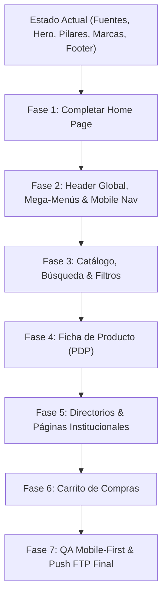

# Plan Maestro de Migración: Boceto (`boceto_web/`) a Tiendanube FTP (`web_ftp/`)

Este plan define la hoja de ruta integral y modular para trasladar todas las vistas, componentes y funcionalidades interactivas desarrolladas en `boceto_web/` al tema productivo Tiendanube Legacy en `web_ftp/`, utilizando el flujo `tiendanube theme ftp`.

---

## 📌 Estado de Situación Actual (Lo ya migrado)

En el último commit (`9a4f00d`) y en los smoke tests previos ya se pasaron exitosamente los siguientes componentes clave a `web_ftp/` y se desplegaron vía FTP:

- [x] **Sistema Tipográfico Oficial y Tokens**:
  - Familias **Quedora** (5 pesos) y **Plus Jakarta Sans** (7 variantes) alojadas en `web_ftp/static/fonts/`.
  - Inyección `@font-face`, preloads y FontAwesome 6 en `web_ftp/layouts/layout.tpl`.
  - Tokens globales de color institucional (`#3FAA47`, `#000000`, etc.) y tipografía en `web_ftp/static/css/style-tokens.tpl`.
- [x] **Hero Slider Principal de Inicio**:
  - Implementado en `web_ftp/snipplets/home/home-slider.tpl`.
  - 3 slides de alta resolución (`web_ftp/static/images/hero/`), autoplay pausado a 8.5s, transiciones CSS y soporte táctil swipe para móviles.
- [x] **Propuesta de Valor / 4 Pilares**:
  - Implementado en `web_ftp/snipplets/banner-services/banner-services.tpl`.
  - Layout responsive mobile-first (fila continua en desktop $\ge 992$px y grilla compacta 2x2 en móviles).
- [x] **Marquesina Continua de Marcas Oficiales (Marquee)**:
  - Creado en `web_ftp/snipplets/home/home-brands.tpl` con los 21 logotipos vectoriales de fabricantes líderes en `web_ftp/static/images/brands/`.
  - Animación infinita suave (`--marquee-speed: 42s`) con pausa al hover.
- [x] **Página de Contacto & Sucursales (Smoke Test)**:
  - Rediseño de `web_ftp/templates/contact.tpl` con Google Maps embebido, horarios y acordeón FAQ nativo.
- [x] **Footer Global (Smoke Test)**:
  - Rediseño de `web_ftp/snipplets/footer/footer.tpl` con columna de marca, acento verde en títulos, medios de pago reales y fondo negro puro.

---

## 🗄️ Principio Rector: Integración con la Base de Datos Real de Tiendanube

> [!IMPORTANT]
> **Cero datos mockeados en `web_ftp/`**:
> En el prototipo interactivo (`boceto_web/`), los productos, categorías, carrito y precios se generaban con datos de prueba estáticos en JavaScript (`app.js`, `localStorage['hmc_cart']`).
> 
> **En la migración a `web_ftp/`, el boceto actúa exclusivamente como CAPA VISUAL (HTML/CSS/UX). Todos los datos se obtienen dinámicamente de la base de datos de Tiendanube a través de su motor de plantillas server-side (Twig-like) y sus endpoints nativos:**

| Dominio | En `boceto_web/` (Mock / Prototipo) | En `web_ftp/` (Base de Datos Real de Tiendanube) |
| :--- | :--- | :--- |
| **Productos de Portada** | Array `PRODUCTS` hardcodeado en JS | Objeto nativo `sections.sale.products`, `sections.primary.products` administrado desde el panel de Tiendanube. |
| **Catálogo & Precios** | Precios y fotos fijas en mock JSON | `products` en `category.tpl`: precios en ARS en tiempo real, descuentos calculados por plataforma, imágenes en CDN de Tiendanube (`product.featured_image`). |
| **Cuotas & Promociones** | Texto fijo "6 cuotas fijas" | Integración con pasarelas de pago reales activas en la tienda vía `product.installments_info` / `snipplets/payments/`. |
| **Stock & Variantes** | Stock ficticio en local | `product.stock`, `product.variations`, matrices de atributos reales y bloqueo automático si no hay stock disponible. |
| **Árbol de Categorías** | Archivo estático `categories-data.js` | Objeto nativo global `categories`: 13 categorías, subcategorías y rubros reales del catálogo con sus URLs canónicas (`category.url`). |
| **Búsqueda & Filtros** | Búsqueda por `Array.filter()` en cliente | Motor de búsqueda nativo de Tiendanube (`/search/?q=...`) y filtros server-side (`product_filters`, `filter_categories`). |
| **Carrito & Checkout** | Simulado en `localStorage['hmc_cart']` | Objeto nativo de sesión `cart` (`cart.items`, `cart.total`), endpoints AJAX de plataforma y pasaje directo al **Checkout oficial** de Tiendanube. |
| **Envíos & Logística** | Cálculo estimado simulado | Calculadora nativa de Tiendanube (`snipplets/shipping/`) conectada a las tarifas reales de Correo Argentino, Andreani y puntos de retiro. |
| **Datos de Negocio** | Textos estáticos en HTML | Objetos nativos `store.name`, `store.address`, `store.phone`, `store.email`, etc. |

---

---

### Fase 1: Completar la Página de Inicio (Home Page Core) — ✅ COMPLETADO
> **Objetivo**: Completar las secciones restantes del Home de Tiendanube para que replique exactamente el impacto visual, la jerarquía y el orden del boceto.

- [x] **1.1. Categorías Destacadas (`#categorias`)** — Desplegado a FTP.
- [x] **1.2. Ofertas Especiales con Countdown Timer (`#ofertas`)** — Desplegado a FTP.
- [x] **1.3. Video Showcase Bleed (`#video-showcase`)** — Desplegado a FTP.
- [x] **1.4. Soluciones Especializadas / Banners de Sectores** — Desplegado a FTP.
- [x] **1.5. Sección Parallax Showroom & Casa Central Santa Rosa (`#sucursal-central`)** — Desplegado a FTP.
- [x] **1.6. Testimonios de Clientes (`#nosotros`)** — Desplegado a FTP.

---

### Fase 2: Header Global, Mega-Menús y Experiencia Móvil de Navegación — ✅ COMPLETADO
> **Objetivo**: Reemplazar la barra estándar de Tiendanube por la arquitectura de navegación unificada del boceto, con mega-menús alfabéticos y barra inferior estilo App para teléfonos.

- [x] **2.1. Barra Superior, Buscador y Utilidades**:
  - Top announcement bar con marquesina animada ("Envíos a todo el país / 6 cuotas fijas / Puesta en marcha") + accesos a Sucursal Santa Rosa y WhatsApp Factura A.
  - Buscador predictivo en escritorio + botón desplegable táctil en mobile (`#btnMobileSearchToggle` + `#mobileSearchBar`).
  - Utilidades: Mi Cuenta, Carrito con badge reactivo de unidades, y menú hamburguesa.
- [x] **2.2. Mega-Menús Desktop de Categorías y Marcas**:
  - **Categorías**: Mega dropdown con las 12 categorías principales en orden alfabético estricto (4 columnas x 3 filas), conectado a base de datos de Tiendanube + CTA a *"Todas las categorías →"*.
  - **Marcas**: Dropdown con las 8 marcas oficiales líderes (OREGON, NIWA, BOSCH, EINHELL, HUSQVARNA, GARDENA, SENSEI, HONDA) + CTA directo *"Todas las marcas →"*.
  - **Secuencia comercial unificada**: `Inicio` $\rightarrow$ `Categorías` $\rightarrow$ `Marcas` $\rightarrow$ `Ofertas` (badge `OFF`) $\rightarrow$ `Nosotros` $\rightarrow$ `Contacto` $\rightarrow$ `Asesoría Técnica` (botón WhatsApp destacado).
- [x] **2.3. Menú Móvil Lateral (Drawer) & Barra Inferior Fija (Bottom App Bar)**:
  - Drawer táctil off-canvas con buscador, acordeones de Categorías y Marcas (tap targets $\ge 44$px) y card directa de WhatsApp.
  - Barra inferior fija estilo app (`.mobile-bottom-nav`) con 5 accesos directos (*Inicio, Categorías, Marcas, Carrito, Menú*).
  - WhatsApp flotante sincronizado con auto-elevación para no solapar la barra inferior ni el sticky buy bar.

---

### Fase 3: Catálogo, Búsqueda y Filtros Técnicos
> **Objetivo**: Llevar a Tiendanube el layout de catálogo industrial (`catalog.html`) con filtros reactivos, chips activos y tarjetas de producto optimizadas.

#### 3.1. Barra Lateral de Filtros y Drawer Táctil en Móviles
- **Archivos a modificar**: `web_ftp/templates/category.tpl`, `templates/search.tpl`, `web_ftp/snipplets/grid/filters-sidebar.tpl`, `filters-modals.tpl`.
- **Detalle**:
  - Filtros por categoría y marcas oficiales con contadores reales.
  - Filtros rápidos tipo interruptor: Envío Gratis, En Stock, Solo Ofertas.
  - En móviles: Modal/drawer deslizable inferior para filtrar y ordenar sin recargar.

#### 3.2. Chips Activos de Filtros
- **Archivos a modificar**: `web_ftp/snipplets/grid/filters.tpl`, `web_ftp/static/js/store.js.tpl`.
- **Detalle**: Píldoras interactivas de filtros activos con botón de borrado individual y botón *"Limpiar todo"*.

#### 3.3. Banner Dinámico de Ofertas en Catálogo
- **Archivos a modificar**: `web_ftp/templates/category.tpl`.
- **Detalle**: Despliegue automático del banner premium de liquidación (`#catalogOffersPromoBanner`) al filtrar por ofertas especiales.

#### 3.4. Tarjetas de Producto (`item.tpl`)
- **Archivos a modificar**: `web_ftp/snipplets/grid/item.tpl`.
- **Detalle**:
  - Badge de oferta porcentual y badge de cuotas destacadas (6 cuotas fijas sin interés).
  - Botón directo de compra / consulta rápida a WhatsApp.
  - Indicador visual de stock disponible.

---

### Fase 4: Ficha de Detalle de Producto (PDP)
> **Objetivo**: Replicar la ficha técnica de producto (`product.html`) con panel de compra B2B, calculadora logística y pestañas estructuradas.

#### 4.1. Panel de Compra y Precios
- **Archivos a modificar**: `web_ftp/templates/product.tpl`, `web_ftp/snipplets/product/product-form.tpl`.
- **Detalle**:
  - Galería de imágenes con selector de miniaturas táctiles.
  - Visualización clara de 6 cuotas fijas sin interés y descuento por pago transferencia/efectivo.
  - Selector numérico de cantidad y botones "Comprar Ahora", "Agregar al Carrito" y botón WhatsApp pre-cargado con SKU y modelo.

#### 4.2. Pestañas Técnicas de Producto
- **Archivos a modificar**: `web_ftp/snipplets/product/product-description.tpl`.
- **Detalle**: Sistema de tabs navegables:
  1. *Especificaciones Técnicas* (tabla estructurada clave/valor).
  2. *Descripción y Aplicaciones*.
  3. *Garantía y Servicio Técnico Oficial HMC*.
  4. *Preguntas Frecuentes / Opiniones*.

#### 4.3. Sticky Buy Bar Móvil
- **Archivos a modificar**: Nuevo snipplet `web_ftp/snipplets/product/product-sticky-buy.tpl`, `web_ftp/static/css/style-async.scss`.
- **Detalle**: Barra inferior adhesiva que aparece tras hacer scroll en la ficha de producto en móviles, con miniatura, precio y botón de compra directa sin solapar el botón de WhatsApp.

---

### Fase 5: Directorios Especiales y Páginas Institucionales
> **Objetivo**: Integrar las 3 páginas exclusivas de `boceto_web/` como plantillas personalizadas en Tiendanube (`templates/page.*.tpl`).

#### 5.1. Directorio Jerárquico de Categorías (`/categorias`)
- **Archivos a crear**: `web_ftp/templates/page.categories.tpl`, JS y estilos asociados.
- **Detalle**:
  - Arquitectura Master-Detail B2B: Sidebar izquierda fija con los 13 rubros alfabéticos + panel derecho con subcategorías Nivel 2 y familias Nivel 3 con progressive disclosure (`+ Ver X familias más`).
  - Navegación Drill-Down en 2 pasos para móviles con botón *"Volver a todos los rubros"*.
  - Buscador reactivo en tiempo real con resaltado visual (`<mark>`).

#### 5.2. Directorio Completo de 113 Marcas (`/marcas`)
- **Archivos a crear**: `web_ftp/templates/page.brands.tpl`.
- **Detalle**:
  - Buscador instantáneo de marcas con botón de limpieza rápida.
  - Barra de salto alfabético horizontal (A-Z, #, TODAS).
  - Grilla estructurada con badges oficiales y contadores reales de catálogo.

#### 5.3. Página Institucional "Nosotros" (`/nosotros`)
- **Archivos a crear**: `web_ftp/templates/page.about.tpl`.
- **Detalle**:
  - Historia y manifiesto de marca ("HMC no compite por precio, compite por respaldo").
  - 4 pilares y métricas B2B (+15 años, +25.000 clientes, +100 marcas).
  - Bloque Showroom & Casa Central Santa Rosa con glassmorphism y Google Maps.

---

### Fase 6: Carrito de Compras & Flujo de Conversión
> **Objetivo**: Optimizar el carrito ajax lateral y la página completa de carrito para maximizar el ticket promedio y la tasa de conversión.

#### 6.1. Drawer / Panel AJAX de Carrito
- **Archivos a modificar**: `web_ftp/snipplets/cart-panel.tpl`, `cart-item-ajax.tpl`.
- **Detalle**: Diseño limpio con imagen, título, selector de cantidad, subtotal y botón de checkout destacado.

#### 6.2. Página Completa de Carrito (`/carrito`)
- **Archivos a modificar**: `web_ftp/templates/cart.tpl`, `web_ftp/snipplets/cart-totals.tpl`.
- **Detalle**:
  - Barra de progreso interactiva para alcanzar el Envío Gratis.
  - Validador de cupones de descuento.
  - Resumen sticky de compra con desglose de impuestos y cuotas.
  - Transformación responsive de tabla a tarjetas táctiles individuales en móviles.

---

### Fase 7: QA Integral, Optimización de Performance y Despliegue FTP Definitivo
> **Objetivo**: Garantizar el estándar Mobile-First, la ausencia de errores en producción y sincronizar vía FTP.

1. **Auditoría Mobile-First & Cross-Browser**:
   - Inspección rigurosa en 360px, 390px, 414px y 768px.
   - Tap targets mínimos de 44px en todos los botones y enlaces.
   - Verificación de ausencia de scroll horizontal involuntario.
2. **Optimización de Assets**:
   - Compilación final de `web_ftp/static/css/style-async.scss` y `style-critical.scss`.
   - Carga lazy (`lazyload`) de todas las imágenes WebP.
3. **Despliegue FTP y Verificación en Vivo**:
   - Ejecución de `tiendanube theme ftp push -y`.
   - Purga de caché y comprobación en vivo en `https://www.hmchub.com.ar`.

---

## 🎯 Orden Recomendado de Ejecución

1. **Paso Inmediato**: **Fase 1 (Completar Home Page)** $\rightarrow$ Permite cerrar al 100% la portada principal, aprovechando que el Hero Slider, los 4 Pilares y las Marcas ya están subidos.
2. **Segundo Paso**: **Fase 2 (Header, Mega-Menús y Navegación Mobile)** $\rightarrow$ Unifica la navegación de toda la tienda.
3. **Tercer Paso**: **Fase 5 (Directorios de Categorías, Marcas y Nosotros)** $\rightarrow$ Resuelve los destinos de los enlaces del Header.
4. **Cuarto Paso**: **Fase 3 y Fase 4 (Catálogo y Ficha de Producto)** $\rightarrow$ Perfecciona el núcleo de compra y búsqueda.
5. **Quinto Paso**: **Fase 6 y Fase 7 (Carrito, QA y Push FTP Final)**.
